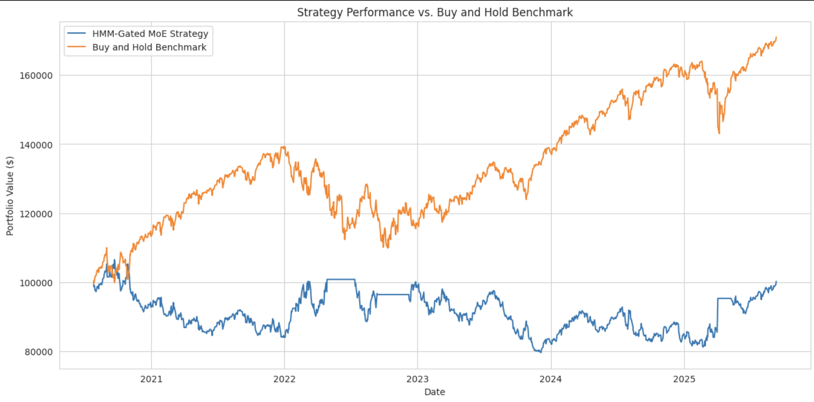

# Predicting Market Regimes with a Hidden Markov Model-Gated Mixture of Experts

The Unified Payments Interface (UPI) is the backbone of India’s digital payments ecosystem, processing billions of transactions monthly. Accurately forecasting UPI transaction volumes is essential for banks, payment gateways, fintech firms, and policymakers to plan infrastructure, optimize liquidity, and monitor economic trends.

However, this time-series data is non-trivial — it exhibits:
	•	Strong seasonality (e.g., spikes during Diwali and festive seasons)
	•	Long-term growth trends (due to rapid digital adoption)
	•	Non-linear fluctuations (influenced by policy shifts, inflation, and macroeconomic shocks)

To address this, we design a hybrid forecasting model that blends classical and deep learning paradigms — SARIMA + LSTM — achieving a balanced synthesis of statistical rigor and neural adaptability.
---

## 📊 Example Output

**Figure 1:** Strategy Performance vs Buy and Hold Benchmark on the UPI data.


---

## 🔎 Modelling

The hybrid model works as follows:
	1.	SARIMA models and forecasts the baseline time series.
	2.	LSTM is trained on SARIMA’s residuals (errors).
	3.	The final prediction = SARIMA forecast + LSTM residual correction.

This fusion yields a model that excels in both interpretability and accuracy.

---

## 🏗️ Project Structure

The workflow is modularized into **five Jupyter Notebooks**, designed to be run in sequential order:

1. **EDA.ipynb**
   - Understand and prepare UPI data for modeling.
   - Enrich with macroeconomic indicators — Consumer Price Index (CPI), Index of Industrial Production (IIP).
   - Perform time-series decomposition (trend, seasonality, residuals).
   - Test stationarity with the Augmented Dickey-Fuller (ADF) test.
   - Visualize insights with Matplotlib/Seaborn/Plotly.

2. **SARIMA.ipynb**
   - Build a robust classical baseline.
   - Determine optimal (p, d, q) × (P, D, Q) parameters via ACF/PACF plots.
   - Conduct residual diagnostics to identify remaining patterns.
   - Export residuals for use in the LSTM stage.

3. **LSTM.ipynb**
   - Learn and predict SARIMA’s residuals.
   - Transform residuals into supervised sequences using sliding windows.
   - Model Architecture:
	•	1–2 LSTM layers with dropout regularization.
	•	Dense output layer for single-step prediction.
   - Saves trained model weights.

4. **Backtest.ipynb**
   - Combine SARIMA + LSTM and assess predictive performance.
   - Evaluation Metrics:
	•	Root Mean Squared Error (RMSE)
	•	Mean Absolute Percentage Error (MAPE)
   - Models Compared:
	1.	Baseline SARIMA
	2.	Standalone LSTM
	3.	Hybrid SARIMA + LSTM (final model)
   - Plot actuals vs forecasts for all three models to illustrate the hybrid model’s superior accuracy and reduced residual variance.

---

## ⚙️ How to Run

### 1. Clone the Repository
```bash
git clone https://github.com/your-username/your-repository-name.git
cd your-repository-name
